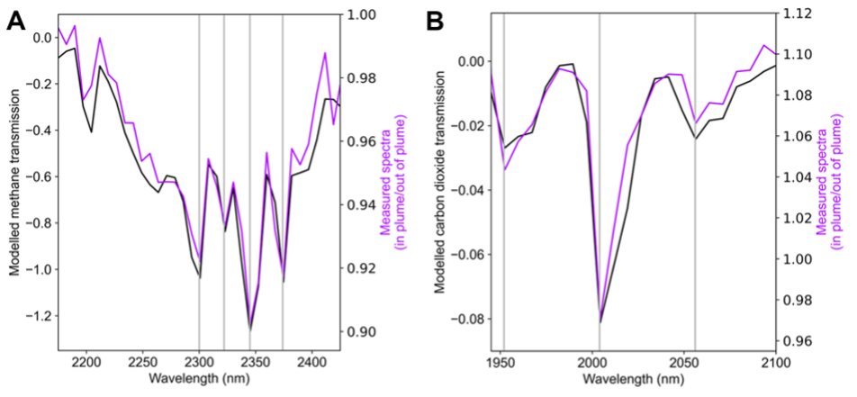
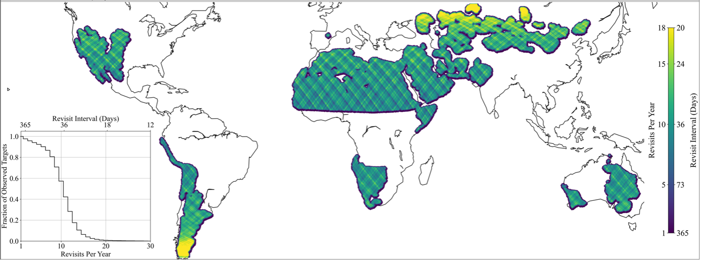
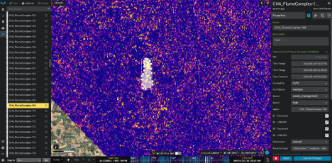

## **Earth Surface Mineral dust source InvesTigation (EMIT)** 

# **EMIT L2B Algorithm: Masks** 

*Philip G. Brodrick*1
*Andrew K. Thorpe*1
*Jay Fahlen*1
*David R Thompson*1

1Jet Propulsion Laboratory, California Institute of Technology

**Version:** 2.0  
**Release Date:** TBD  
**JPL- D-107866**  

Jet Propulsion Laboratory 
California Institute of Technology 
Pasadena, California 91109-8099 

**Change Log**
| Version | Date       | Comments |
|---------|------------|----------|
| 0.0     | August 30, 2023 | Initial Draft |
| 0.1     | June 24, 2024 | CO2 Product Additions |
| 0.2     | March 10, 2025 | Per-pixel Uncertainty and Sensitivity Estimates (V002 Enhancements) |
| 2.0     | November 20, 2025 | V002 Plume Estimates |

**Product Release History**

- V001 Enhancements - The first release of enhancement estimates, delivered only for locations where a plume was identified as part of the V01 Plume product.
- V002 Enhancements - Revised enhancement estimates including uncertainty and sensitivities, delivered for all granules with L1B Radiance and L2A Reflectance data. 
- V001 Plume - Initial plume identifications, based on V01 Enhancements.
- V002 Plume - Second plume identifications, based on V02 Enhancements, including quantification for select plumes. 

## **1. Key Teammembers**

Philip G. Brodrick (Jet Propulsion Laboratory) 
Andrew K. Thorpe (Jet Propulsion Laboratory) 
Jay Fahlen (Jet Propulsion Laboratory)
David R. Thompson (Jet Propulsion Laboratory) 
Clayton Elder (NASA Ames Research Center) 
Claire S. Villanueva-Weeks (Jet Propulsion Laboratory) 
Jay Fahlen (Jet Propulsion Laboratory) 
Red Willow Coleman (Jet Propulsion Laboratory) 
K. Dana Chadwick (Jet Propulsion Laboratory) 
Mandy Lopez (Jet Propulsion Laboratory) 
Daniel Jensen (Jet Propulsion Laboratory) 
Quentin Vinckier (Jet Propulsion Laboratory) 
Chuchu Xiang (Jet Propulsion Laboratory) 
Robert O. Green (Jet Propulsion Laboratory) 

The EMIT Science and Applications team played a critical role in testing and evaluating
iterations of the algorithms described below.

## **2. Historical Context and Background on the EMIT Mission and its Instrumentation**

Mineral dust aerosols originate as soil particles lifted into the atmosphere by wind erosion. Mineral dust created by human activity makes a large contribution to the uncertainty of direct radiative forcing (RF) by anthropogenic aerosols (USGCRP and IPCC) and is a prominent aerosol constituent around the globe. However, we have poor understanding of its direct radiative effect, partly due to uncertainties in the dust mineral composition. Dust radiative forcing is highly dependent on its mineral-specific absorption properties. The current range of iron oxide abundance in dust source models translates into a large range of values, even changing the sign of the forcing (-0.15 to 0.21 W/m2) predicted by Earth System Models (ESMs) (Li et al., 2020). The National Aeronautics and Space Administration (NASA) selected the Earth Surface Mineral Dust Source Investigation (EMIT) to close this knowledge gap. NASA launched an instrument to the International Space Station (ISS) to directly measure and map the soil mineral composition of critical dust-forming regions worldwide.

In addition to its primary objective described above, EMIT has demonstrated the capacity to characterize methane (CH4) and carbon dioxide (CO2) point source emissions by measuring gas absorption features in the shortwave infrared (Fig. 1, Thorpe et al., 2024).  This document breaks from the other mission Algorithm Theoretical Basis Documents (ATBDs), as the CH4 and CO2 products are not part of the standard series of interconnected science products.  Readers should consult the L1B ATBD for the precursor products to what are used here. 

The EMIT Project is part of the Earth Venture-Instrument (EV-I) Program directed by the Program Director of the NASA Earth Science Division (ESD). EMIT is comprised of a VSWIR Infrared Dyson imaging spectrometer adapted for installation on the International Space Station (ISS). EMIT measures radiance between 380 and 2500 nanometers, with an approximate 7 nm bandpass.  Data are collected in a swath that is approximately 75 km wide at the equator, with an approximate ground sampling distance of 60 m.  

Figure 2 shows the regions that were the primary focus of the nominal 1-year mission with a focus on mapping arid regions of the globe. The expected distribution of the EMIT revisit rates is also shown, with a median of 10 revisits per annum, and 90% of the target mask having between 3 and 15 revisits. Beyond the primary 1-year mission, any terrestrial region between (+51.6° and -51.6° latitude) could be imaged.  

Figure 1: Examples of methane (A) and carbon dioxide (B) spectral fingerprints (purple lines) and modeled gas transmission (black line). The strongest absorption features highlighted by the vertical gray lines (Thorpe et al., in press).

Figure 2: Total observations and average revisit interval for nominal 1-year mission (Thorpe et al., in press).

## **3. Algorithm Rationale**

The EMIT GHG Point Source Detection approach builds on a substantial history of remote greenhouse gas detections from airborne imaging spectrometers (Thorpe et al., 2013, 2014, 2017; Thompson et al., 2015; Frankenberg et al., 2016; Duren et al., 2019; Cusworth et al., 2022). We leverage a per-column adaptive matched filter for the primary detection, due to the speed and efficacy of identifying subtle signatures.  We customize the deployment in order to minimize false positives, after which a series of scientists manually review individual plumes in order to provide only instances with maximum confidence.

## **4. Algorithm Implementation**

### **4.1 Input Data**

Input and output products for the EMIT CH4 and CO2 products are held as a combination of binary data cubes with detached human-readable ASCII header files, and cloud optimized GeoTIFFs (COGs; which ultimately constitute the delivery to the LP DAAC).  The former adhere to the ENVI standard (accessible Aug 2023 at https://www.nv5geospatialsoftware.com/docs/ENVIHeaderFiles.html), and the latter adhere to the COG specification (https://github.com/cogeotiff/cog-spec/blob/master/spec.md, accessible Aug 2023).  The header files all consist of data fields in equals-sign-separated pairs and describe the layout of the file.  In the file descriptions below, n denotes the number of lines particular to the given scene, which can vary – it is normally 1280, but for some scenes at the trailing end of an orbit segment, may reach as high as 2559.

The specific input files needed for the primary GHG detection are:

1.	**Measured radiance at sensor**, provided as an n x 1242 x 285 BIL interleave data cube (rows, columns, wavelength).
2.	**Observation geometry**, provided as n x 1242 x 11 BIL interleave data cube (rows, columns, bands).
3.	**Geographic lookup table**, provided as an orthorectified BIL interleave binary data set with 2 bands (x and y lookup indices) and a variable number of rows and columns.
4.	**Mask file**, provided as an n x 1242 x 7 BIL interleave data cube (rows, columns, bands) – this is an output product of L2A with the shortname EMIT_L2A_MASK on delivery.
5.	**Bandmask file**, provided as an n x 1242 x 36 BIL interleave data cube (rows, columns, bands) – this is an output product of L2A with the shortname EMIT_L2A_MASK on delivery.

### **4.2 Theoretical Description**

The procedures that follow outline a procedure for identifying methane enhancements that are clearly separable from any background noise, and which can be identified as point source emissions.  As with all measurements, instrument noise and algorithmic error present some amount of false positives, which we mitigate through manual review of identified plume complexes. We describe the algorithms used here but encourage interested parties to examine the publicly available code for all details, as the precise implementation of the procedure is ultimately quite important.  All algorithms used here are based heavily on existing literature (Thompson et al., 2015).

#### 4.2.1 GHG Enhancements

##### Training Data

EMIT’s methane enhancement product is created using an adaptive matched filter. This method searches each spatial pixel’s radiance spectrum for deviations that are characteristic of methane’s absorption spectrum. Its sensitivity is increased by using the covariance matrix estimated from the data to “whiten” or decorrelate the data during processing. There are three main components to the matched filter algorithm: the signal vector $s$, the spectral covariance matrix $C$ and the de-meaned data $x-\mu$ for each spatial pixel. The matched filter expression is 

$$
MF = \frac{s^T C^{-1} (x - \mu)}{s^TC^{-1}s},
$$

where $\mu$ and $C$ are estimated from the data using the spectral radiance in each column separately. The covariance matrix is calculated using a simple shrinkage method in which the standard empirical covariance is weighted by ($1-a$) and summed with its diagonal weighted by $a$, with $a=10^{-9}$. The signal vector is defined to be the change in radiance with respect to a unit change the methane concentration length and is computed from two components. The first component is computed as a normalized finite difference derivative of the radiance at two different simulated methane quantities, given by $t=\frac{1}{L}  \frac{\Delta L}{ \Delta c}$, where $L$ is computed using MODTRAN 6 with the amount of water vapor determined using the L2 retrieved water vapor quantity and $\Delta c$ represents the two simulated methane concentration lengths in the MODTRAN runs used to compute $\Delta L$. In order to better match the radiance and its calibration, the second component is simply the mean radiance, again computed column by column. Combining the two yields $s=t \mu$ evaluated as an element-wise product.

Matched filter performance is determined in part by calculating the covariance estimate using representative samples of the data. Accordingly, each spectrum in a single column is used as a sample, excluding saturated pixels, pixels flagged as clouds or surface water, and unusually bright pixels (“flares” or other hot objects). Pixels are flagged as flares using a simple radiance threshold on channel 270 (approximately 2389 nm). The threshold is the largest radiance that is likely to occur without a flame as determined using MODTRAN to model the radiance in a nadir look with the sun directly overhead having no atmospheric water vapor or methane and assuming 80% surface reflectivity. Very few materials have reflectivity exceeding 80% in this channel. Any spectra exceeding this threshold without having flares are likely to be sufficiently unusual that their exclusion from the covariance estimate will not be detrimental. These bright pixels (along with those flagged as clouds or water from the L2A mask) are excluded from the mean and covariance estimates, and also subsequently from the matched filter results, as the radiance enhancement from thermal emission can exaggerate matched filter detections. 

#### 4.2.2 GHG Enhancement Sensitivity

The GHG enhancement is biased for each pixel whose radiance spectrum deviates from the mean radiance spectrum used in the matched filter. The bias is due to the fact that the absorption is multiplicative but the matched filter is additive. A correction factor to remove the bias is derived in Fahlen et al. 2024, given by

$$
S = \frac{s^T C^{-1} \frac{x s}{\mu}}{s^T C^{-1} s},
$$

where the product $\frac{xs}{\mu}$ is to be calculated element by element. The matched filter bias can be removed by dividing by $S$, although caution should used as the sensitivity correction can dramatically inflate the background noise in dim pixels. The sensitivity is a positive, unitless quantity.

#### 4.2.3 GHG Enhancement Sensitivity

In order to improve the matched filter and the new sensitivity and uncertainty products, the channels used in the matched filter have been adjusted. The matched filter now uses all the channels that fall within 500-1340 nm, 1500-1790 nm, or 1950-2450 nm. This change results in a minor difference to the matched filter output while reducing the impact of strong atmospheric absorption channels in the inverse covariance estimates.

#### 4.2.4 Plume Complex Identification

The methane enhancement data contains elevated values over true methane sources, but also contains false positives induced by various surface or atmospheric characteristics.  To mitigate the presence of these false positives, each scene undergoes a manual review process before being designated as a plume, where three different reviewers check each plume complex.  Here, we use the term ‘plume complex’ rather than ‘plume’ because in many cases individual plumes cannot be isolated from one another given the observation geometry and spatial resolution of the instrument; a plume complex may be a single plume or composed of multiple overlapping plumes.  Plume complexes may also not be true plumes – general enhancements from a given point source are also included if there is sufficient evidence that the enhancement is not a false positive, even if the enhancements lack a characteristic plume shape.  We describe the manual identification and review procedure below in the order it is performed.  In order for a plume complex to be reported as output, it must be identified by a primary reviewer, and pass checks by both reviewer 2 and reviewer 3.  Reviewers may communicate with one another to improve the overall procedure, and to discuss challenging cases, but concurrence must be reached prior to publication.  

The process is designed to be conservative – if a plume complex is questioned by one of the reviewers, it is excluded from delivery.  Because of this conservatism, the product does not include every point source enhancement, and should not be treated as comprehensive.  An internal confidence scheme is used by the reviewers strictly for their communication – any plume that makes it through the complete review process, however, is deemed high confidence.   

All plume identification and review is conducted through custom layers of the Multi Mission Geospatial Information System (MMGIS), which has been configured to view matched filter and quicklook images from EMIT as they are produced by the Science Data System, and which records observations in a database for subsequent use – see Figure 3.  A series of background scripts record information from reviewers and facilitate iteration on candidate plume complex imagery.  The review process proceeds as follows:

**Reviewer 1 – Primary Plume Complex Identification**
Reviewer 1 is responsible for primary identification of candidate plume complexes.  Understanding that two reviews follow, Reviewer 1 may be more permissive in the inclusion of potential plume complexes than subsequent reviews.  Generally, Reviewer 1 follows a finding and flagging scheme, where any enhancement substantially elevated from the background is considered ‘found’, but may receive a ‘flag’ for a number of known issues that may lead to false positives.  If a potential plume complex receives a flag (for reasons described below) it is discarded.  The following sequence is used by  Reviewer 1:
1.	Gain confidence of the full scene
Assign flags for scenes overwhelmingly dominated by cloudiness, high levels of background noise, snow, and extreme topography.
2.	Assess cloud cover
Clouds and water are masked (using masks from the L2A_MASK) during the matched filter generation, but as the masks themselves are imperfect, some amount of cloud contamination – often edges – makes it through the matched filter result.  Clouds often are shown as bright in the matched filter result, and the light field can be distorted in immediate cloud proximity.  Therefore Reviewer 1 should maintain a sense of cloud coverage (using scaled radiance data from EMIT as reference) within the scene, and ultimately flag any potential plume complexes that are on cloud edges or shadows.
3.	Visually scan matched filter results at a coarse zoom level
a.	Identify obvious enhancements – generally very high levels, and/or with distinct plume morphology. If no flags are identified, these are deemed ‘very high’ confidence detections.
b.	Toggle between matched filter and EMIT radiance data (RGB), checking for clear correlations with surface features and known problem surfaces (e.g. solar panels).
c.	When a suspected plume complex does not match the EMIT RGB layer and is not over extreme topography nor in immediate proximity to clouds, look for a plausible source like infrastructure and identify if it is a potential methane emitter. This is done using high resolution basemap imagery from multiple sources, with some external research on nearby facilities or by using google maps and street view to look for less visible viable methane emitters (trash, oil pumps, mine shafts). If no possible infrastructure is apparent, label the plume complex as ‘mystery’ for further examination.  Mystery plume complexes will be accepted if the signal is strong and fully uncorrelated with surface features, and/or if there is temporal evidence to support the plume complex (see Reviewer 2). 
4.	Visually scan the matched filter at a fine zoom level
Identify enhancements that still stand out from the background but are not as clear those observed from the full scene view.  A confidence level of ‘high’, ‘medium’, and ‘low’ are then given based on the enhancement magnitude, enhancement size (area), and the presence of infrastructure.  Steps 3b and 3c from above are repeated.  Enhancements that are tagged as ‘low’ in this confidence scheme are discarded (not reviewed by Reviewer 2 or 3) but are preserved for future review and analysis through time.

Any time a potential plume complex is identified by Reviewer 1, it is recorded into MMGIS.  Additional metadata is recorded, and a global unique identifying index is assigned.  The reviewer delineates the enhancement from the background, which is also subject to subsequent review.  Delineation includes a small (several pixel) buffer, to demonstrate separation between the enhancement and the background.

Figure 3: MMGIS interface for plume complex identification and review.

**Reviewer 2 – Background Noise Consideration and Plume Shape Adjustment**
Reviewer 2 examines each plume complex for quality.  Two primary factors influence Reviewer 2’s decisions: 1) the background level of the scene, and 2) any temporal imagery of the same location.  For the first criteria, Reviewer 2 determines if an enhancement can be reasonably separated from other bright values within the scene.  If an identified plume complex sits at the same elevated rate as other noise within the scene, it is flagged and removed – notably, these enhancements may be real, but are not credibly separable from the background, and so removed in order to remain conservative in identification.  Reviewer 2 also utilizes other imagery available through time as a secondary check.  Spurious correlations with background materials tend to be persistent through time (given similar illumination conditions), while true plume complexes tend to drift due both to variable wind speed and direction and/or source emission rates.  Areas with persistent enhancements in both shape and magnitude are very likely false positives and are removed.  Areas where no plume complex is visible at one point and time but is distinctly visible in a second lend additional credibility to a complex. For plume complexes tagged as ‘mystery’ – which do not show plausible infrastructure nearby, temporal variability or strong signatures which are substantially decorrelated from the surface are necessary for approval.

**Reviewer 3 –  Comprehensive Review**
Prior to publishing a plume complex, a final comprehensive review is performed. Reviewer 3 first assesses the prior reviews by Reviewer 1 and 2 then performs an independent assessment of each plume complex candidate. Greenhouse gas enhancement maps are compared to EMIT RGB scenes to screen out any potential false positives associated with surface spectroscopy or atmospheric component like clouds. Enhancements are also compared with publicly available higher resolution true color imagery that provides additional spatial context. In some cases, an analysis of EMIT spectra are used to screen out surfaces that have strong spectral signatures in the shortwave infrared (for example calcium carbonate).

#### 4.2.5 Plume Emission Rate Estimation

Once a plume has been published, it is a candidate for emission rate estimation. We use a simple method to estimate the emission rate that calculates a plume’s Integrated Mass Enhancement (IME) and plume length (“fetch”) length. These are combined with a wind speed estimate to compute the emission rate Q in units of kg/hr. Termed “Simple IME,” the method assumes that the detected plume is due to a localized point gas source that is emitting at a constant rate (Duren, 2019). The emitted gas is then carried by a constant wind as it diffuses in the crosswind direction. Since mass is conserved in each crosswind slice, we can relate the detected gas enhancement to the emission rate through $Q=w IME/f$, where $w$ is the wind speed and $f$ is the fetch length. IME is calculated by converting concentration length in each into mass enhancement and then summing over a set of detected pixels, given by

$$
IME = \sum_{i \in P} k l_i
$$

where $P$ is the set of pixels within the plume mask (described below). The conversion factor $k$ depends on the temperature and pressure of the gas and is given by $k=g^2 M_{CH_4}  \frac{P}{RT}$, where $g$ is the ground sampling distance (approximately 60 m for EMIT), $M_{CH_4}$ is the molecular mass of $CH_4$, $P$ and $T$ are the pressure and temperature, respectively, and $R$ is the ideal gas constant. The pressure and temperature are not known, so EMIT uses a standard MODTRAN atmosphere along with the elevation at the plume's apparent origin to approximate them. Here we have assumed a slab geometry for the plume and that the sunlight has passed through it twice: once as the light comes down from the sun to the surface and then again after it reflects up to the sensor.

The set of pixels $P$ are chosen based on the manually identified plume origin along with simple image processing techniques. First, a circular region of pixels centered on the origin is selected for consideration. These are then thresholded to find a set of connected components. All connected components within a minimum distance of each other are combined into a single plume mask. The final set of pixels $P$ is then determined by excluding all those that are outside the manually-determined plume boundary to help reduce noise. The fetch length is calculated as the distance between the two points in $P$ that are farthest apart. For the plumes delivered here, we used a concentration length threshold of 500 ppm m, a circular radius of 1 km, and a maximum connected distance of 200 m. 

For a plume to be considered for emission rate estimation, it must appear to meet the assumptions of the Simple IME method. Namely, the plume must appear to be due to a single point source whose emitted $CH_4$ is then carried downwind. Plumes with multiple apparent origins (“plume complexes”) are excluded as are those that appear to be from a spatially large, distributed source or have stagnant winds. Plumes are also excluded if their manually-determined origin is located far from their apparent source, a circumstance that can cause Simple IME to fail. Each plume candidate has undergone two rounds of assessment to determine whether it meets these criteria.

The windspeed is derived from publicly available weather models. Plumes in the continental US use High-Resolution Rapid Refresh (HRRR) UGRD 10 m and VGRD 10 m wind products. All other plumes use ERA-5 Land Data products 10m_u_component_of_wind and 10m_v_component_of_wind accessed from the Copernicus Climate Change Service. In both cases we select the nine gridpoints nearest the manually-determined plume origin at each of the two nearest time samples. The final windspeed is calculated by interpolating in time and space. These reanalysis products do not provide uncertainties for the wind speed so we use the standard deviation of the eighteen points as a proxy for uncertainty.

### 4.3 Practical Considerations

Computation of the adaptive matched filter is very quick relative to other steps in the EMIT SDS (e.g. L2A reflectance).  The manual review process, however, is labor and time intensive.  All code used for the matched filter enhancement is available at the EMIT GHG repository https://github.com/emit-sds/emit-ghg.  The scientist review portal is based off of code available at https://github.com/NASA-AMMOS/MMGIS/tree/development, and interfaces with code in the EMIT GHG repository.

## 5. Output Data

Output data for the EMIT methane products are divided into several outputs, which are stored and delivered as a combination of COGs and GeoJSONs.  As such, products are orthorectified with a variable numbers of rows and columns. Specifically the methane products are:

EMIT L2B Methane Enhancement Data (EMITL2BCH4ENH) and EMIT L2B Estimated Methane Plume Complexes (EMITL2BCH4PLM).

1.	Methane Enhancement Data (EMITL2BCH4ENH), provided as 3, 1-band cloud optimized GeoTIFFs with variable number of rows and columns, projected using WGS 84 (EPSG: 4326). These outputs contain the per-pixel estimated methane enhancement, the per-pixel estimated methane uncertainty, and the per-pixel estimated methane sensitivity, with various cloud, water, and saturation masks in place to minimize false positives.  Outputs are delivered on a scene-by-scene basis.
2.	Methane Plume Complexes (EMITL2BCH4PLM), provided as a 1-band cloud optimized GeoTIFF with variable number of rows and columns, projected using WGS 84 (EPSG: 4326). This output contains the per-pixel estimated methane enhancement, cut to a specific plume complex.  This product is not constrained to fall within a single scene.
3.	Methane Plume Complex Metadata (EMITL2BCH4PLM), provided as a GeoJSON.  This metadata file contains information including which scenes the plume complex came from, an outline of the plume complex, the coordinates of the maximum enhancement values, and the quantitative uncertainty of the CH4 enhancement within the plume complex.

And the carbon dioxide products are:

EMIT L2B Carbon Dioxide Enhancement Data (EMITL2BCO2ENH) and EMIT L2B Estimated Carbon Dioxide Plume Complexes (EMITL2BCO2PLM).

4.	Carbon Dioxide Enhancement Data (EMITL2BCO2ENH), provided as 3, 1-band cloud optimized GeoTIFFs with variable number of rows and columns, projected using WGS 84 (EPSG: 4326). These outputs contain the per-pixel estimated carbon dioxide enhancement, the per-pixel estimated carbon dioxide uncertainty, and the per-pixel estimated carbon dioxide sensitivity, with various cloud, water, and saturation masks in place to minimize false positives.  Outputs are delivered on a scene-by-scene basis.
5.	Carbon Dioxide Plume Complexes (EMITL2BCO2PLM), provided as a 1-band cloud optimized GeoTIFF with variable number of rows and columns, projected using WGS 84 (EPSG: 4326). This output contains the per-pixel estimated methane enhancement, cut to a specific plume complex.  This product is not constrained to fall within a single scene.
6.	Carbon Dioxide Plume Complex Metadata (EMITL2BCO2PLM), provided as a GeoJSON.  This metadata file contains information including which scenes the plume complex came from, an outline of the plume complex, the coordinates of the maximum enhancement values, and the quantitative uncertainty of the CO2 enhancement within the plume complex.

## 6. Calibration, uncertainty characterization and propagation, and validation

### 6.1 Uncertainty quantification

Uncertainty in the measured concentration field comes from two primary sources.  First, the natural measurement noise of any physical instrument induces some variability in the measured matched filter results.  We take the first noise source as a multivariate Gaussian distribution with zero mean and covariance $C_{meas}$.  Second, background signals themselves have some variability; while in theory this “clutter” need not be Gaussian distributed, it is often effective to model them as an independent noise source with zero mean and covariance $C_{bg}$. These two sources are independent, so the covariances of the two noise sources add to form the total noise, $C = C_{meas} + C_{bg}$. To propagate this error through the matched filter retrieval, we recognize that the matched filter is simply a linear operator α applied to $(x-\mu)$:

$$
MF = (x-\mu)^T \alpha, \quad \alpha = \frac{C^{-1} s}{s^T C^{-1} s},
$$

This enables a simple analytical forward propagation of the noise distribution, transforming the noise distribution by that linear operator to yield the noise-equivalent change in methane:

$$
Ne_{\Delta CH_4} \sim N(0, \alpha^T C \alpha)
$$

This raises the question of how to estimate $C$.  We have direct knowledge of $C_{meas}$ from instrument radiometric models, but do not have access to $C_{bg}$ . Moreover, the background clutter may change as a function of location and time.  Fortunately, as in the construction of the matched filter itself, an unbiased estimator for the complete noise expression $Ne_{\Delta CH_4}$  can be obtained by sample statistics of areas with no methane enhancement.  Consequently, we estimate the sample covariance of the dataset outside all plume complexes within the set of scenes from which a given plume complex is identified.  This empirical standard deviation indicates the uncertainty of the methane measurement throughout the scene.  

In the ideal scenario, these values would be uniformly zero – in practice they tend to fall below 500 ppm m, though vary scene by scene.  It is possible that unidentified plume complexes – true positives within a scene that are not ranked high enough in confidence to be determined as a plume complex – inflate this uncertainty estimate in some cases.

### 6.2 Uncertainty in Each Pixel

In addition to the scene-wide uncertainty described above, an uncertainty due to sensor noise for each spatial pixel is provided following Fahlen et al., 2024. The per-pixel uncertainty is given 

$$
U^2 = \frac{s^T C^{-1} \Sigma(x) C^{-1} s}{(s^T C^{-1} \frac{xs}{\mu})^2},
$$

where $\frac{xs}{\mu}$ is interpreted as element-by-element products. The EMIT noise model is used to produce the diagonal matrix $\Sigma(x)$, the specifics of which can be found in the GitHub repository for the source code at instrument_noise_parameters/emit_noise.txt. The uncertainty is in the same units as the GHG enhancement product: [ppm m].

### 6.3 Emission Rate Uncertainty 

Uncertainty in the plume emission rate comes from many sources, including:
- wind speed
- twice-through assumption
- gas pressure and temperature
- confusing surface materials that generate false $CH_4$ enhancements
- plume mask and fetch length
- measurement noise from the instrument

It is not possible to quantify the uncertainty due to all of these sources, so we provide a lower bound on the uncertainty by propagating wind speed and measurement noise uncertainty. Propagating these two uncertainties through the expression for Q above, we find

$$
\sigma_Q^2 = \frac{w^2}{f^2} \sum_{i \in P} k^2 \sigma_{l_i}^2 + \frac{k^2 IME^2}{f^2} \sigma_w^2
$$

where $\sigma_{li}$ is the concentration length uncertainty described above and $\sigma_w$ is the wind speed uncertainty.

### 6.4 Validation Efforts

EMIT validation activities are integral to continued demonstration of its greenhouse mapping capability. Future plans include utilizing the AVIRIS-3 instrument (Coleman, 2025), an airborne equivalent of EMIT, to permit comparison of results obtained from space with EMIT. Comparison of EMIT greenhouse gas results with other satellite instruments (i.e., GHGSat, OCO-3) are also planned in addition to controlled release experiments.

## 7. Constraints and Limitations
No constraints or limitations are imposed on the EMIT methane or carbon dioxide products.  All delivered data will have undergone quality control and should be considered valid, calibrated data up to the reported uncertainties in input parameters.  Unanticipated data corruption due to factors outside the modeling, if discovered, will be reported in peer reviewed literature and/or addenda to this ATBD.

## 8. Code Repository and References
All code used for the matched filter enhancement is available at the EMIT GHG repository https://github.com/emit-sds/emit-ghg.  The scientist review portal is based on code available at https://github.com/NASA-AMMOS/MMGIS/tree/development, and interfaces with code in the EMIT GHG repository.

## **References**

L. Li, N.M. Mahowald, R.L. Miller, C. Pérez García-Pando, M. Klose, D.S. Hamilton, M. Gonçalves Ageitos, P. Ginoux, Y. Balkanski, R.O. Green, O. Kalashnikova, J.F. Kok, V. Obiso, D. Paynter, and D.R. Thompson: Quantifying the range of the dust direct radiative effect due to source mineralogy uncertainty, Atmos. Chem. Phys., 21, 3973–4005, https://doi.org/10.5194/acp-21-3973-2021 (2021).

A. K. Thorpe, R. O. Green, D. R. Thompson, P. G. Brodrick, J. W. Chapman, C. D. Elder, I.  Irakulis-Loitxate, D. H. Cusworth, A. K. Ayasse, R. M. Duren, C. Frankenberg, Attribution of individual methane and carbon dioxide emission sources using EMIT observations from space. Science advances, 9 no. 46 (2023). 

A. K. Thorpe, D. A. Roberts, E. S. Bradley, C. C. Funk, P. E. Dennison, I. Leifer, High resolution mapping of methane emissions from marine and terrestrial sources using a Cluster-Tuned Matched Filter technique and imaging spectrometry. Remote Sensing of Environment. 134, 305–318 (2013). 

D. R. Thompson, I. Leifer, H. Bovensmann, M. Eastwood, M. Fladeland, C. Frankenberg, K. Gerilowski, R. O. Green, S. Kratwurst, T. Krings, B. Luna, A. K. Thorpe, Real-time remote detection and measurement for airborne imaging spectroscopy: A case study with methane. Atmospheric Measurement Techniques. 8, 4383–4397 (2015). 

A. K. Thorpe, C. Frankenberg, D. R. Thompson, R. M. Duren, A. D. Aubrey, B. D. Bue, R. O. Green, K. Gerilowski, T. Krings, J. Borchardt, E. A. Kort, C. Sweeney, S. Conley, D. A. Roberts, P. E. Dennison, Airborne DOAS retrievals of methane, carbon dioxide, and water vapor concentrations at high spatial resolution: Application to AVIRIS-NG. Atmospheric Measurement Techniques. 10, 3833–3850 (2017). 

A. K. Thorpe, C. Frankenberg, D. A. Roberts, Retrieval techniques for airborne imaging of methane concentrations using high spatial and moderate spectral resolution: Application to AVIRIS. Atmospheric Measurement Techniques. 7, 491–506 (2014). 

R. M. Duren, A. K. Thorpe, K. T. Foster, T. Rafiq, F. M. Hopkins, V. Yadav, B. D. Bue, D. R. Thompson, S. Conley, N. K. Colombi, C. Frankenberg, I. B. McCubbin, M. L. Eastwood, M. Falk, J. D. Herner, B. E. Croes, R. O. Green, C. E. Miller, California’s methane super-emitters. Nature. 575, 180–184 (2019). 

C. Frankenberg, A. K. Thorpe, D. R. Thompson, G. Hulley, E. A. Kort, N. Vance, J. Borchardt, T. Krings, K. Gerilowski, C. Sweeney, S. Conley, B. D. Bue, A. D. Aubrey, S. Hook, R. O. Green, Airborne methane remote measurements reveal heavytail flux distribution in Four Corners region. Proceedings of the National Academy of Sciences of the United States of America. 113, 9734–9739 (2016). 

D. H. Cusworth, A. K. Thorpe, A. K. Ayasse, D. Stepp, J. Heckler, G. P. Asner, C. E. Miller, V. Yadav, J. W. Chapman, M. L. Eastwood, R. O. Green, B. Hmiel, D. R. Lyon, R. M. Duren, Strong methane point sources contribute a disproportionate fraction of total emissions across multiple basins in the United States. Proceedings of the National Academy of Sciences. 119, e2202338119 (2022). 

J. E. Fahlen, P.G. Brodrick, R. W. Coleman, C. D. Elder, D. R. Thompson, A. K. Thorpe, R. O. Green, J. J. Green, A. M. Lopez, and C. Xiang, Sensitivity and Uncertainty in Matched-Filter-Based Gas Detection With Imaging Spectroscopy. IEEE Transactions on Geoscience and Remote Sensing, 62, 1-10, (2024).  

NOAA High-Resolution Rapid Refresh (HRRR) Model was accessed between Jan. 2024 and Nov. 2025 from https://registry.opendata.aws/noaa-hrrr-pds 
 
Copernicus Climate Change Service, Climate Data Store, (2023): ERA5 hourly data on single levels from 1940 to present. Copernicus Climate Change Service (C3S) Climate Data Store (CDS). DOI: 10.24381/cds.adbb2d47 (Accessed between 01-01-204 and 01-11-2025).  License: https://creativecommons.org/licenses/by/4.0/. Generated, using, or contains modified Copernicus Climate Change Service information. Neither the European Commission nor ECMWF is responsible for any use that may be made of the Copernicus information or data it contains. 

R. W. Coleman, A. K. Thorpe, Philip G. Brodrick, Adam Chlus, Jay E. Fahlen, Brian Bue, John Chapman, Regina F. Eckert, Daniel J. Jensen, Michael L. Eastwood, David R. Thompson, Clayton D. Elder, Sergio Gomez Beltran, Diana Rodriguez Amezquita, Francesca Hopkins, Robert O. Green, Identifying and quantifying greenhouse gas emissions with the AVIRIS-3 airborne imaging spectrometer, Remote Sensing of Environment, 332, 2026, 115058, https://doi.org/10.1016/j.rse.2025.115058. 
